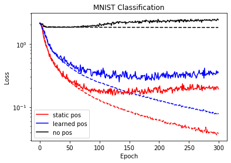

# my_perceiver

This repo implements the perceiver model from (https://arxiv.org/abs/2103.03206). The script `train_all_models.py` trains three models, one with a static, fourier-feature, position encoding, one with a learned position encoding, and one with no position informaiton. All three models are trained on MNIST, with results presented below: 

